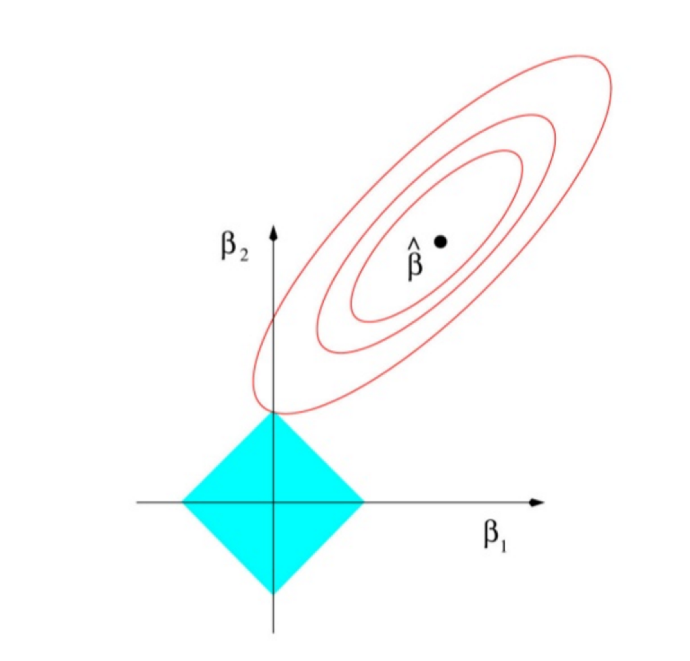
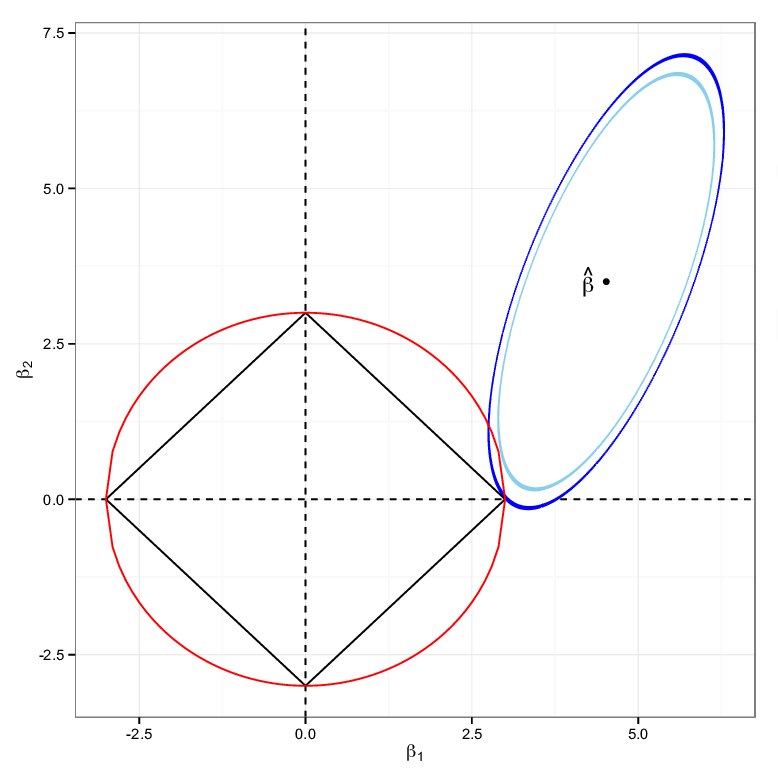

<div dir = 'rtl'>

# هم خطی و مشکلات آن:

در کتاب رگرسیون1 اواخر فصل چهارم در باره ی همخطی و نحوه ی تشخیص آن 
که با vif
تشخیص میدادیم و اینکه اگر وجود داشت داده ها را باید استودنتایز کنیم 
(مرکزی کنیم)
تا مشکل هم خطی رفع شود.
ولی واقعا بعضی از مواقع نمیشود با مرکزی کردن این هم خطی را از بین برد
لذا:

در این فصل قرار هست که بیشتر در مورد مشکل های ناشی از هم خطی چندگانه صحبت کنیم و به راهکار های تشخیص هم خطی پرداخته و برخی راهکار های دیگه از جمله 
رگرسیون مولفه های اصلی و رگرسیون ریج بپردازیم.

## مشکل های ناشی از هم خطی چند گانه:

همانطور که در فصل چهارم کتاب رگرسیون خطی 1 عنوان شد 
زمانی که یک متغیر پیشگو را بتوان با استفاده از یک 
یک رابطه ی خطی توسط سایر متغیر پیشگو نوشت گوییم که هم خطی بوجود آمده است
ممکن هم هست که این هم خطی حدودی باشد(به دلیل عامل تصادفی بودن مقادیر).

زمانی که بین متغیر سطون های ماتریس X
یک رابطه ی تقریبا خطی وجود داشته باشد
بین سطر های X'X
هم همخطی بوجود می آید
پس در نتیجه دترمینان 
X'X
هم خیلی به صفر نزدیک میشود.

و از آنجایی که میدانیم
$Cov(\beta) = \sigma^2(X'X)^{-1}$
و چون دترمینان X'X
کوچک شده درایه های 
$(X'X)^{-1}$
افزایش پیدا میکند.
بنا براین وجود همخطی چند گانه سبب افزایش واریانس ضریب های رگرسیون خطی  میشود.
(برای درک راحت تر فرض کنید که متغیر ها استاندارد شده باشند
آنگاه ماتریس الحاقی یک ماتریسی خواهد بود که قطر اصلی یک و سایر درایه ها همبستگی  را نشان میدهند
.)
$$\frac{1}{det(X'X)}(X'X)^T$$
با افزایش واریانس برآوردگر ها، عرض بازه های اطمینان ضریب های مدل رگرسیون خطی به اشتباه افزایش پیدا میکند
که این باعث میشود که فرض صفر بودن ضریب های مدل رگرسیون خطی با احتمال بیشتری پذیرفته بشود.

</div>

<div dir = 'lrt'>

```{r message=FALSE,warning=FALSE}
data("cement",package = "MASS")
fit <- lm(y~.,data = cement)

confint(fit)

df <- data.frame(name = rownames(confint(fit)),x = coef(fit),l = confint(fit)[,1],u = confint(fit)[,2])
library(ggplot2)
ggplot(df[-1,],aes(name)) + geom_errorbar(aes(ymin = l,ymax = u))+geom_hline(yintercept = 0,color = "red")
```

```{r}
summary(fit)
```

</div>

<div dir = 'rtl'>

همانطور که در داده ها مشاهده می شود هیچ یک از متغیر ها در سطح 95 درصد معنا دار نشده است ولی
میزان 
$R^2$
برابر 
`r round(summary(fit)$r.squared,4)`
شده است 

به عبارت دیگر یک تناقض بین معنی داری ضرایب و 
ضریب تعیین بوجود آمده و آن هم این است که
چطور هیچ یکی از متغیر ها معنا دار نشده ولی مدل این قدر خوب داره برازش رو نشون میده!!!

## راه های تشخیص هم خطی:

- وجود همبستگی های بزرگ در ماتریس X'X به ازای X های استاندارد شده
(فرمول استاندارد سازی:
$\frac{x_j-\bar{x}}{\sqrt{\sum_{i=1}^n(x_i-\bar{x})^2}}$)

</div>

<div dir = 'lrt'>

```{r fig.cap="correlation matrix cement Data"}
cement2 <- sapply(cement, function(x){(x-mean(x))/sd(x)/(length(x)-1)})
pp <- par(mfrow = c(1,2))
corrplot::corrplot(cor(cement2),method = "number")
corrplot::corrplot(cor(cement2),method = "ellipse")
par(pp)
```

</div>

<div dir = 'rtl'>

- عامل تورم واریانس(VIF)
 همانطور که در مقدمه ی این فصل هم گفته شد
 درایه های قطر اصلی X'X
 برای X 
 های استاندارد شده یعنی
 
 $$VIF_j = \frac{1}{1-R_j^2};j = 1,2,3,...$$
 ملاکی برای تشخیص هم خطی چندگانه هستند،
 که در آن 
 $R_j^2$
 رگرسیون خطی ای است که 
 $X_j$
 متغیر پاسخ آن است و سایر متغیر های مستقل به عنوان متغیر پیشگو می باشند
 یعنی:
 
 $$E(X_j|\cup X_i) = \sum_{i=0}^{p}{\beta_iX_i}\ \ \ ;i\neq j;\ X_0 = 1;\ i= 1,2,...,p$$
  مقدار VIF بزرگتر از 5 نشانه ی 
  وجود هم خطی است و
  مقادیر بزرگتر از 10 نشان دهنده هم خطی شدید است.

</div>

<div dir = 'lrt'>

```{r}
car::vif(fit)
```

</div>

<div dir = 'rtl'>

- معیار عدد شرطی($\kappa$)

یک راه ساده ی دیگر برای برای پی بردن به وجود هم خطی در مدل محاسبه ی عدد شرطی برای ماتریس 
$X'X$
است.

در صورت همخطی چندگانه در 
$X'X$
دست کم یکی از مقادیر ویژه ی این ماتریس یعنی 
$\lambda_1,...\lambda_p$
بسیار کوچک میشود
(که این خودش یکی از دلایلی است که دترمینان کوچک میشه جرا که 
$det(A) = \Pi_{i=1}^p\lambda_i$)

آماره ی کاپا را به صورت زیر تعریف میکنند.

$$\kappa = \frac{\lambda_{max}}{\lambda_{min}}$$

معمولا مقدار 
$\kappa$
کمتر از 100 را به معنی نداشتن جدی هم خطی چند گانه تفسیر میکنند

مقدار $\kappa$
بین 100 تا 1000 یعنی همخطی چندگانه با درجه های گوناگون بین متوسط تا زیاد وجود دارد.

$\kappa$
بزرگتر از 1000 یعنی هم خطی بسیار بسیار شدیدی وجود دارد.

</div>

<div dir = 'lrt'>

```{r}
f <- function(x) {
  (x-mean(x))/sqrt(sum((x-mean(x))^2))
}
cement2 <- sapply(cement,f)

cement2 <- cement2[,-5]
t(cement2)%*%cement2
```

```{r}
cement_2 <- as.matrix(cement[-5])
eig <- eigen(t(cement_2) %*% (cement_2))
max(eig$values)/min(eig$values)

eig2 <- eigen(t(cement2) %*% cement2)
max(eig2$values)/min(eig2$values)
```

</div>

<div dir = 'rtl'>

## راهکار های اصلاح اثر همخطی چندگانه

- انتخاب متغیر(feature selection یا variable selection):

 در بخش قبل و فصل 5 کتاب رگرسیون1 دربارهی انتخاب متغیر و انتخاب بهترین زیر مدل ها صحبت شد.
 روشهای انتخاب متغیر از میان چنند متغیر پیشگوی همبسته، که همگی
 همبستگی بالایی با متغیر پاسخ دارند زیاد مطلوب نیست.

- افزایش حجم نمونه:

بسیاری از اوقات افزایش حجم نمونه به طوری که از تعداد متغیر ها خیلی خیلی بیشتر باشد می تواند باعث از بین رفتن هم خطی بشود.
ولی خب مشکل این روش این است که خیلی هزینه بر است.

- رگرسیون مولفه های اصلی

در این روش به خاطر اینکه دترمینان 
$X'X$
به صفر نزدیک هست، برای اینکه هم خطی را از بین ببریم کاری که میکنیم این است که 
بردار های ویژه ی متناظر با کوچکترین مقدار های ویژه ی این ماتریس را حذف میکنیم، اینطوری بدون اینکه متغیری رو از مدل حذف کنیم مشکل هم خطی رو از بین بردیم.

- رگرسیون ریج

این روش حالت خاصی از رگرسیون جریمه شده است در این روش ما به جای اینکه
مجموع توان های دوم خطا
($s(\beta) = (y-X\beta)'(y-X\beta)$)
را مینیمم کنیم میایم یک تابع جریمه هم به مدل اظافه میکنیم
و اون رو کم مینیمم میکنیم
یعنی:

$$S(\beta , \alpha) = (y-X\beta)'(y-X\beta) + \alpha \sum_{i=0}^p|\beta_i|^2$$
 که به $\alpha$
 پارامتر منظم کننده گفته میشود.

در این بخش میخواهیم که با بیشتر در مورد دومورد آخر صحبت کنیم.

## رگرسیون ریج

رگرسیون ریج هم یک نوع خاصی از رگرسیون های جریمه شده است.

که در آن هدف بر کمینه سازی تابع زیر است

$$S(\beta , \alpha) = (y-X\beta)'(y-X\beta) + \alpha \sum_{i=0}^p|\beta_i|^2$$
برای تابع هدف 
$S(\beta,\alpha)$
نقطه ی مینیمم وجود دارد، زیرا یک تابع مشتق پذیر است
برای حل مساله ی کمینه سازی بالا، با برابر قرار دادن مشتق های جزیی این تابع  برابر صفر
و حل یک دستگاه معادلات به جواب برسیم.

$$\frac{\partial S(\beta,\alpha)}{\partial \beta} = -2X'y+2X'X\beta+2\alpha \beta =0$$
که در نهایت برآورد گر ریج $\beta$
 به صورت زیر بدست می آید
 $\hat{\beta_R} = (X'X+\alpha I_p)^{-1}X'y$

با افزودن مقدار مثبت $\alpha$
به درایه های قطر اصلی ماتریس 
$X'X$
سبب افزایش دترمینان ماتریس بدست آمده و در نتیجه کاهش درایه های ماتریس وارون آن میشود.


واضح است که $\beta_R$
یک برآوردگر نا اریب است.
زیرا:
$$\hat{\beta_R} = (X'X+\alpha I_p)^{-1}X'X\hat{\beta}$$
$$E(\hat{\beta_R}) = Z_k E(\hat{\beta}) = Z_k\beta \ \  ;\ \ Z_k = (X'X)^{-1}X'X$$

### برآورد پارامتر اریب ساز:

یک راه مناسب برای اینکه بتوانیم مقدار $\alpha$ را تخمین بزنیم این است که:

به روش زیر عمل کنیم.

1. مقدار $\alpha$ را با استفاده از فرمول زیر بدست آوریم
$$\alpha = \frac{p\sigma^2}{\beta'\beta}$$

با توجه به اینکه $\beta$ و $\sigma$
نا معلوم هستند لذا باید آنها را با استفاده از رگرسیون خطی برآورد کنیم
بنابراین داریم:

$$\hat{\alpha} = \frac{p\hat{\sigma}}{\hat{\beta}' \hat{\beta}}$$
2. $\hat{\alpha}$ را در فرمول زیر قرار بده و 
$\hat{\beta_R}$ 
را محاسبه کن

$$\hat{\beta_R} = (X'X+\alpha I_p)^{-1}X'y$$

3. $\hat{\sigma_R^2}$ را از طریق فرمول زیر محاسبه کن

$$\frac{(y-X\hat{\beta_R})'(y-X\beta_R)}{n-p}$$
4. $\hat{\alpha}$ نهایی از فرمول زیر محاسبه میشود:

$$\frac{p \hat{\sigma_R^2}}{\hat{\beta_R'} \hat{\beta_R}}$$

</div>

<div dir = 'lrt'>

```{r}
cement2 <- as.data.frame(sapply(cement, scale))
fit <- lm(y~.,data = cement2)
beta <- coef(fit)
sigma <- anova(fit)[5,3]
p <- length(beta)
#---
alpha1 <- as.vector(p*sigma/(t(beta)%*%beta))
#---
X <- model.matrix(fit)
beta2 <- solve(t(X)%*%X + alpha1 *diag(p)) %*% t(X)%*%cement2$y
#---
sigma2 <- (t(cement2$y - X%*%beta2) %*% (cement2$y - X%*%beta2))/(nrow(cement2)-p)
alpha2 <- as.vector(p*sigma2/(t(beta2)%*%beta2))
#alpha2

(coefs <- solve(t(X) %*% X + alpha2 * diag(p)) %*% t(X) %*%cement2$y)


```


```{r}
library(lmridge)

(lm.ri3 <- lmridge(y~.,data = cement2,K = alpha2))
```


```{r}
library(glmnet)
library(glmnet)
lambda_seq <- 10^seq(2,-2,len = 100)
x <- model.matrix(cement2$y~.,data = cement2)
fit <- glmnet(x,cement2$y,alpha = 0,lambda = alpha2) # alpha = 1 is lasso
```

```{r}
coef(fit)
alpha2
```

</div>

<div dir = 'rtl'>

در هر دو تابع معرفی شده برای محاسبه ی رگرسیون ریج
میتوان برای آرگومان 
lambda
یک بردار داد
در خروجی زیر مشاهده میشود که چگونه با افزایش مقدار 
$\alpha$
ضرایب معنی دار میشوند.

</div>

<div dir = 'lrt'>

```{r}
lm.ri3 <- lmridge(y~.,data = cement2,K = seq(from = 0,to = 1,by = 0.01))
```


```{r}
plot(lm.ri3)
```

</div>

<hr>

<div dir = 'rtl'>

### تفاوت رگرسیون ریج و رگرسیونی لاسو

به تصاویر اشکال زیر توجه کنید:







</div>
